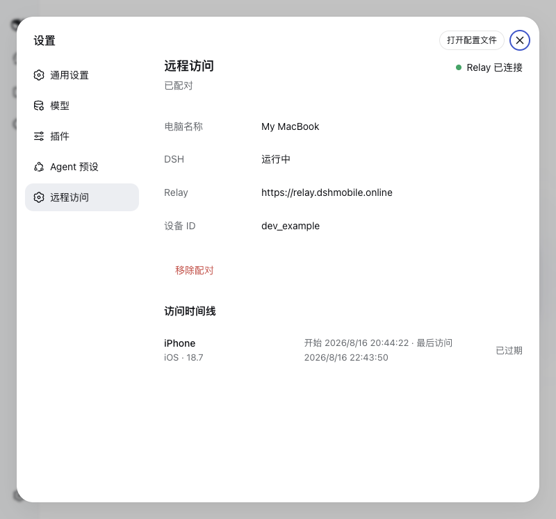

# DSH Mobile Remote

Access a local DeepSeek Harness Web UI from a paired phone through an outbound-only Relay connection.

> **Community project:** this is an unofficial project, independently developed and maintained by the community. It is not reviewed, endorsed, or supported by DeepSeek.

**Complete project, signed Android APK, and private Relay package:** [DSH Mobile Suite](https://github.com/april-jk/dsh-mobile-suite)



## Compatibility

The current release is tested against `@deepseek-ai/dsh@0.1.0-rc.6`. DeepSeek Harness is in Developer Preview and may introduce breaking plugin changes. CI pins this version so compatibility changes are explicit.

Requirements:

- Node.js 18 or newer
- DeepSeek Harness `0.1.0-rc.6`
- A phone running the companion DSH Mobile app
- HTTPS access to the configured Relay

## Install

The immutable GitHub tag is the recommended public installation path:

```bash
dsh plugin --profile web add github:april-jk/dsh-mobile-plugin#v0.1.2
dsh web
```

Each GitHub Release also contains a prebuilt `.tgz`. It can be downloaded and installed without running a source build:

```bash
dsh plugin --profile web add ./april-jk-dsh-mobile-0.1.2.tgz
dsh web
```

Once the public npm package is available, the equivalent registry install is:

```bash
dsh plugin --profile web add @april-jk/dsh-mobile@0.1.2
dsh web
```

To uninstall:

```bash
dsh plugin --profile web remove @april-jk/dsh-mobile
```

For local development:

```bash
npm ci
npm run build
dsh plugin --profile web add "/absolute/path/to/dsh-mobile-plugin"
dsh web
```

## Pair a phone

Open **Settings > Remote Access** in the local DSH Web UI and generate a six-digit code or QR code. Log in on the mobile app and claim it once. Later DSH starts reuse the device credential stored in `~/.dsh-remote/config.json` with owner-only permissions.

The same settings page can remove the pairing. Removal revokes the Relay device credential, disconnects active remote access, and clears the local credential only after the Relay confirms the operation. The `dsh-mobile unpair` command provides the same behavior when the Web UI is unavailable.

## Network and data behavior

- DSH remains bound to `127.0.0.1:3080`; the plugin never creates a public listener.
- The computer opens an outbound WSS connection to `https://relay.dshmobile.online` by default. Set `DSH_RELAY` before starting DSH to use another compatible Relay.
- The Relay forwards authenticated HTTP and WebSocket traffic. MVP traffic is protected by TLS but does not yet have application-level end-to-end encryption.
- The plugin stores its Relay device token locally in `~/.dsh-remote/config.json` and never sends that token to the mobile client.
- The Relay records bounded phone metadata and access times for the access timeline. It does not persist DSH request or response bodies.
- Installing this bundle disables DSH's native directory picker and enables the browser-based picker so remote browsers can choose a directory without opening Finder or another native dialog.

For a private Relay, start DSH with the same HTTPS origin configured in the mobile app:

```bash
DSH_RELAY=https://relay.example.com dsh web
```

## Standalone commands

The fallback CLI is installed as `dsh-mobile` and supports `start`, `pair`, `status`, and `unpair`. Normal users should manage pairing through the DSH settings page.

## Development

```bash
npm ci
npm run build
npm test
npm pack --dry-run
```

`dist/` is committed intentionally so GitHub installs have a complete plugin without lifecycle scripts. CI rebuilds it and rejects stale generated output. Tags matching `v*` create a GitHub Release containing the prebuilt npm tarball.

## Community discovery

The repository should use the `dsh-plugin` and `deepseek-harness` GitHub topics. A single-project post for the official plugin Discussion category can use:

`DSH | DSH Mobile Remote | Access your local DSH Web UI from a paired phone`

A ready-to-post project description is maintained in [`docs/SHOW-YOUR-PLUGIN.md`](docs/SHOW-YOUR-PLUGIN.md).

## License

[MIT](LICENSE)
